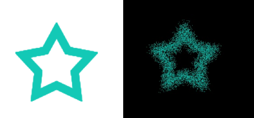

## Canvas + JavaScript 制作图片粒子效果
 
首先看一下源图和转换成粒子效果的对比图：



左侧图片为源图，右侧图片为粒子效果图。该效果是在Canvas画布上制作的。将图片制作成粒子效果相对而言是比较简单的。重点了解两个知识点即可

1:图片是通过image对象形式绘制在画布上的，然后使用Canvas的getImageData接口，获取图像的像素信息。

    var imageData=ctx.getImageData(x, y, width, height);
        参数说明：x，y为画布上的x和y坐标, width，height为获取指定区域图像的信息

返回值说明：imageData为返回值，它是一个对象，包含三个属性

```bash
imageData={
    data:Unit8ClampedArray[10000] //一个包含图片区域内每个像素点的RGBA的整型数据信息
    height:200   //读取的图片像素信息区域高度
    width:200 　　//读取的图片像素信息区域宽度
}
```

2:了解像素区域数据的排布说明，以上获取的图片数据像素信息(imageData对象中的data属性)为RGBA整型的一维数组数据。一个像素是有4个值（R,G,B,A）组成的。也就是说，数组信息每四个为一个像素点。因此，有以下规则，

　　  第一个像素信息为：RGBA(data[0],data[1],data[2],data[3])

      第二个像素信息为：RGBA(data[4],data[5],data[6],data[7])

      .....

      第N个像素信息为: RGBA(data[(n-1)*4],data[(n-1)*4+1],data[(n-1)*4+2],data[(n-1)*4+3])

      .....

　　另外，像素区域既然是一个区域，它是有宽和高的。上面的推算公式适合单独一行使用定位一个像素点。所以计算像素点时要考虑到在整个图像区域内定位：

　　以上图为例。图像的宽和高都为200，如果按照每一个像素为一行一列时。则该图像共有200行，200列。所以要取得 i 行第 j 列的像素初始位置信息为：

　　　　　　var pos =[( i-1 )*200]+( j-1 )]*4;

　　其中，公式中的 i 表示行数，j 表示列数。200为图像的宽度。

```bash
<!DOCTYPE html>
<html>
<head lang="en">
    <meta charset="UTF-8">
    <title></title>
</head>
<body>
<canvas id="myCanvas" width="600" height="400" style="background:#000">浏览器不支持canvas</canvas>
</body>
<script type="text/javascript">
    var canvas=document.getElementById("myCanvas");
    var ctx=canvas.getContext("2d");

    var image = new Image();
    image.src='/WebWorkspace/EchartDemo/images/star.png';

    var pixels=[];  //存储像素数据
    var imageData;
    image.onload=function(){
        ctx.drawImage(image,200,100,200,200);
        imageData=ctx.getImageData(200,100,200,200);    //获取图表像素信息
        getPixels();    //获取所有像素
        drawPic();  //绘制图像

    };

    function getPixels(){
        var pos=0;
        var data=imageData.data;    //RGBA的一维数组数据
        //源图像的高度和宽度为200px
        for(var i=1;i<=200;i++){
            for(var j=1;j<=200;j++){
                pos=[(i-1)*200+(j-1)]*4; //取得像素位置
                if(data[pos]>=0){
                    var pixel={
                        x:200+j+Math.random()*20, //重新设置每个像素的位置信息
                        y:100+i+Math.random()*20, //重新设置每个像素的位置信息
                        fillStyle:'rgba('+data[pos]+','+(data[pos+1])+','+(data[pos+2])+','+(data[pos+3])+')'
                    }
                    pixels.push(pixel);
                }

            }
        }
    }

    function drawPic(){
        var canvas=document.getElementById("myCanvas");
        var ctx=canvas.getContext("2d");
        ctx.clearRect(0,0,600,400);
        var len=pixels.length,curr_pixel=null;
        for(var i=0;i<len;i++){
            curr_pixel=pixels[i];
            ctx.fillStyle=curr_pixel.fillStyle;
            ctx.fillRect(curr_pixel.x,curr_pixel.y,1,1);
        }
    }


</script>

</html>
```
