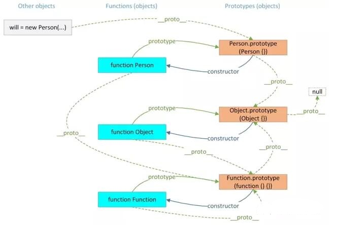

# js原型
  js每声明一个function，都有prototype原型，prototype原型是函数的一个默认属性，在函数的创建过程中由js编译器自动添加。
也就是说：当生产一个function对象的时候，就有一个原型prototype。

# js原型链
  因为每个对象和原型都有原型，对象的原型指向原型对象，
而父的原型又指向父的原型对象，这种原型层层连接起来的就构成了原型链。
  
  原型链是实现继承的主要方法。其基本思想是：利用原型让一个引用类型继承另一个应用类型的属性和方法。
简单回顾一下构造函数、原型和实例的关系：每个构造函数都有一个原型对象，原型对象都包含一个指向构造函数的指针，而实例都包含一个指向原型对象的内部指针。

如图很容易理解：



原型链基本模式，如下:
```bash
function A（）{
this.Aproperty = "111";
}

A.prototype.getA = function(){
return this.Aproperty;
};

function B(){
this.Bproperty = "222";
}

B.prototype = new A();//B继承A，但是会导致构造函数指向混乱
B.prototype.getB = function(){
return this.Bproperty;
};

var C = new B();
console.log(C.getA());//111
```
B原型（B.prototype）指向了A的实例对象，而A的实例对象的构造器是构造函数A，所以B.prototype.constructor就是构造对象A了（换句话说，A构造了B的原型）。这时候会导致原型链混乱，加一句B.prototype.constructor=B改变构造函数指向解决混乱问题。

# __proto__属性

JS 在创建对象（不论是普通对象还是函数对象）的时候，都有一个叫做__proto__ 的内置属性，用于指向创建它的构造函数的原型对象。
对象 person1 有一个 __proto__属性，创建它的构造函数是 Person，构造函数的原型对象是 Person.prototype ，所以：
person1.__proto__ == Person.prototype


